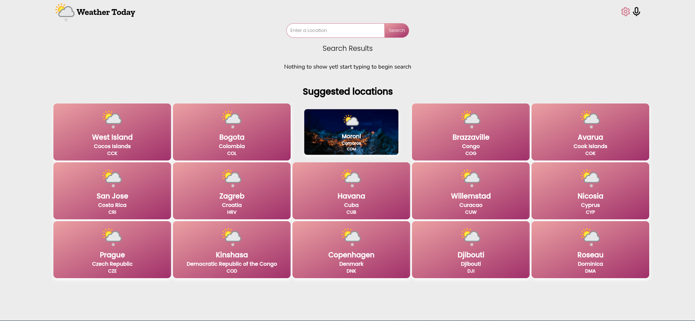
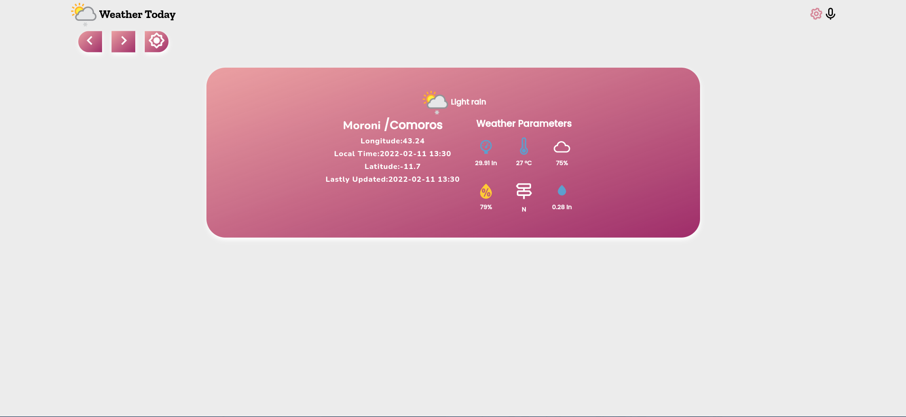

# BookStore
Weather-Today is a web application that enables users to get information about the weather condition of different areas around the world. Once the app is opened, users are presented with a homepage that shows suggested locations. There's also a seach bar that allows users to search for places, including countries, cities, regions and even suburbs. Its built using React




## Video presentation
[Video](https://www.loom.com/share/c168cf8638084c2996c22fd6694ed215)

## Live Demo
[Live Link](/)

## Technologies Used
* Languages (JSX, CSS)
* Library (React)
* Git
* Gitflow
* Jest

## Software Requirements
* Node.JS
* npm
* Code Editor
* Git

## Installation
* Clone the repo using the command below

```
git clone git@github.com:charlesgobina/weather-today.git
```

* Navigate to the directory in which you cloned the project and use the command below

```
cd weather-today
```

* Install all project dependencies and packages using the command below

```
npm install
```

* Start the server to run the application locally using the command below

```
npm start
```

## Authors
Charles Gobina :student: 
* Github:https://github.com/charlesgobina 
* Twitter:https://twitter.com/i4mCloud
* LinkedIn:https://www.linkedin.com/in/charles-gobina-74a0ab193/

## Contributing :handshake:
Contributions, issues, and feature requests are welcome!
* Fork this repo using the command below

```
gh repo fork git@github.com:charlesgobina/weather-today.git
```
* Clone the forked repo using the command below

```
git clone git@github.com:charlesgobina/weather-today.git
```

* Navigate to the directory in which you cloned the project and use the command below

```
cd weather-today
```

* Switch to dev branch using the command below

```
git checkout dev
```

* Create a new feature branch using the command below

```
git checkout -b [name_of_feature_branch]
```

* Commit your changes using git commit as shown below

```
git commit -m ["entere a commit message"]
```

* Push your changes using

```
git push -u origin [name_of_feature_branch]
```
* Open pull request to the dev branch


## Show your support
Give a 	:star: if you like this project.

## Acknowledgments
* Original design idea by [Nelson Sakwa on Behance.](https://www.behance.net/gallery/31579789/Ballhead-App-%28Free-PSDs%29). Under the [Creative Commons License](https://creativecommons.org/licenses/by-nc/4.0/)
* Hat tip to anyone whose code was used
* Inspiration
* etc

## License :memo:
This project is [MIT](https://github.com/microverseinc/readme-template/blob/master/MIT.md) licensed